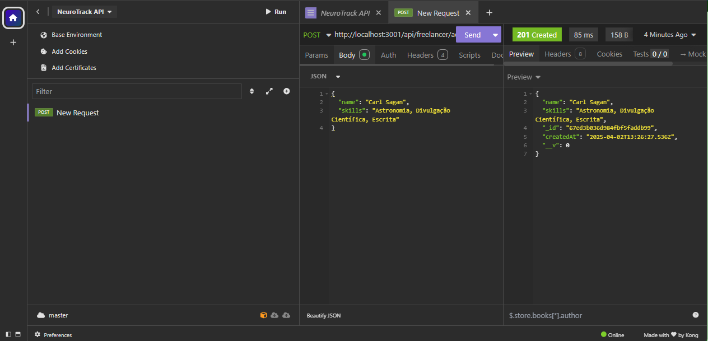

# NeuroTrack
 

*NeuroTrack* é uma plataforma full stack para gerenciamento de freelancers, tarefas e projetos. Criada com foco em escalabilidade, segurança e experiência do usuário.

 

[*Acesse a versão online do projeto aqui*](https://neurotrack-frontend.onrender.com)

---
 

## Visão Geral
 

> O NeuroTrack nasceu para simplificar a organização de tarefas em ambientes colaborativos.  
> Seu diferencial está na junção entre funcionalidade, performance e um design suave e moderno.  
> A interface neomórfica, os testes de API no Insomnia e a estrutura escalável tornam essa aplicação pronta para crescer.

---
 

## Tecnologias Utilizadas
 

### Frontend
- [React](https://reactjs.org/)
- [Vite](https://vitejs.dev/)
- Axios para requisições HTTP
- Estilização com CSS moderno e componentes modulares
- UI com inspiração *Neumorphism Design*

 
 

### Backend
- [Node.js](https://nodejs.org/)
- [Express](https://expressjs.com/)
- [MongoDB](https://www.mongodb.com/)
- Autenticação com JWT
- Middlewares personalizados
- Arquitetura MVC

### Testes
 
- [Insomnia](https://insomnia.rest/) para testes das rotas e autenticação
 

> Exemplo de requisição testada no Insomnia:
 

---

## Funcionalidades

- Cadastro e login com autenticação JWT
- Registro e gerenciamento de freelancers
- Criação e visualização de tarefas
- Interface responsiva e com foco em UX
- Comunicação com o backend via API segura
- Feedback visual e modais interativos

---

## Como rodar localmente
 

### Pré-requisitos

 

- Node.js e npm instalados
- MongoDB (pode ser local ou Atlas)

### Clonar o projeto

 

git clone https://github.com/gabycancello/neurotrack.git
cd neurotrack

---

### Rodando o Backend

 

cd server
npm install
npm run dev

 

Crie um arquivo .env com:
 

MONGO_URI=seu_link_mongodb
JWT_SECRET=sua_chave_secreta
 

### Rodando o Frontend

 

cd client
npm install
npm run dev

 

Crie um .env com:
 

VITE_API_URL=http://localhost:5000

---

 
 

## Deploy

•	Frontend: neurotrack-frontend.onrender.com
 
•	Backend: neurotrack-backend.onrender.com

 
 

## Inspiração no Design Neomórfico

 

O projeto utiliza um layout inspirado no Neumorphism, buscando:
 
	•	Sombras suaves e relevos sutis
  
	•	Botões e cards com estética clean
  
	•	Interface com foco na suavidade da interação

  
  

 # Contato
  

 Desenvolvido por Gabriela Cancello
